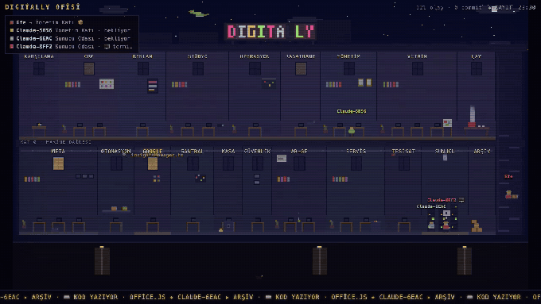

# Digitally Office 🏢🐉

**Geliştirme aktiviteni canlı izleyen retro pixel-art ofis.**



<sub>Demo modu, pakete gömülü örnek veriyle. Kendi reponuzda
<code>npx digitally-office</code> çalıştırın; odalar sizin klasörleriniz olur.</sub>

Repo'nun her modülü bir oda olur. Pixel ajanlar — sen *ve Claude Code
oturumların* — odalar arasında dolaşır, masalara oturur, o an gerçekten
değişen şey üzerinde çalışır. Commit'ler çatıdan roket fırlatır. Bir ejderha
var. Bir de parti tuşu. 🎉

> [**▶ Canlı demo**](https://efecavdar.github.io/digitally-office/?demo=1&lang=tr)
> — tarayıcıda çalışır, kurulum yok.

## Hızlı başlangıç

```bash
cd repo-dizinin
npx digitally-office
```

Bu kadar. Repo'yu tarar, en büyük klasörleri odalara çevirir (oda boyutu ∝ kod
boyutu), dosya sistemini ve git'i izler, `http://localhost:4242`'yi açar.

### Claude Code entegrasyonu (opsiyonel, işin eğlencesi)

```bash
npx digitally-office --install-hooks
```

Küçük bir hook `.claude/hooks/` altına kopyalanır ve `.claude/settings.json`'a
(hiçbir şey ezilmeden) eklenir. Claude oturumlarını yeniden başlat; her oturum
vizörlü kendi pixel ajanı olarak mesaiye gelir: prompt gönderdiğin an 📥 görev
alır, ilk araç çağrısına dek masasında 💭 düşünür, okuduğu dosyanın odasında
🔍 kod okur, iş tipine göre (🎨 UI / ⚙️ backend / 🧪 test) çalışır, `deploy`
komutunda Sunucu Odası'nda roket rampaya çekilir 🚀, turu bitirince ✅ teslim
eder. Sunucu kapalıyken hook ~70 ms'de sessizce çıkar — Claude'u yavaşlatmaz.

## Tuşlar

`p` parti (DJ drop) · `a` müzik modu (mikrofon → görseller) · `f` tam ekran ·
`g` gece/gündüz · `r` oturum panosu · `s` scanline · `m` canlı/demo · `+`/`-` tempo

## Yapılandırma

Repo köküne `.devoffice.json` koy (hepsi opsiyonel): `signText` (çatıdaki neon,
varsayılan klasör adı), `lang` (`"tr"`), `port`, `host`, `capturePrompts`,
`floorNames`, `rooms` (elle oda haritası). `?lang=tr` URL parametresi de çalışır.

## Gizlilik ve ağ

- Sunucu **yalnız `127.0.0.1`**'e bağlanır; ağdaki kimse erişemez. İkinci ekran
  veya projeksiyon makinesi için `--host 0.0.0.0` ile aç — uyarı banner'ı çıkar,
  yalnız güvendiğin ağda kullan.
- Akışta ne var: değişen dosya yolları, oda adları, commit mesajları ve yerelde
  prompt'un ilk 44 / bash komutunun ilk 28 karakteri (ticker yazısı için).
- **Ağa açtığın anda prompt ve komut metni otomatik olarak kesilir.** Tamamen
  kapatmak için `--no-capture-prompts` ya da `"capturePrompts": false`.
- Kayıtlar kendi diskinde: `~/.digitally-office/sessions/*.jsonl`. Hiçbir yere
  veri gönderilmez — telemetri yok, analitik yok, bağımlılık yok.

## Lisans

MIT © Efe Çavdar
